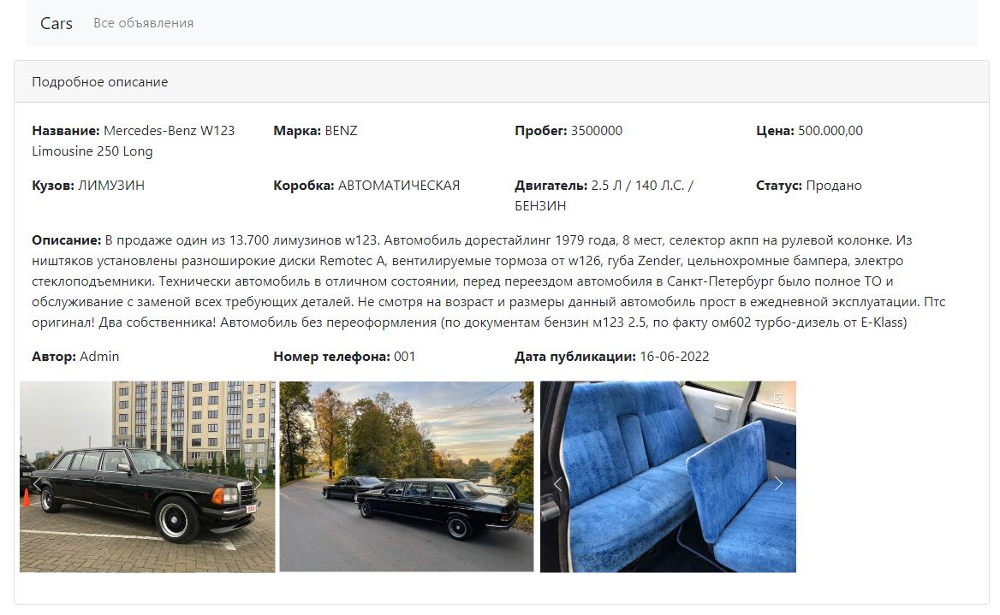

# job4j_cars
О проекте: тестовое задание по hibernate, web приложение для продажи машин

Сборка или установка:
собирается через Maven

Как использовать: пока просто смотреть)

Стек технологий: Spring boot, Thymeleaf, Hibernate.

Контакты:https:
//github.com/zweidmitr

Описание:
- При первом посещении искатель видит главную страницу со списком всех объялений.
  
- при любой попытке взаимодействовать, будет отправлен на страницу авторизации / регистрации,
без авторизации все иные действия фильтруются и перенаправляются обратно.
  
  
- после успешной авторизации, пользователь попадает на главную страницу, где может
    - пользоваться фильтрами отбора,
    - просматривать дополнительную информацию,
    - создавать свое объявление
- при просмотре объявления, доступно только чтение
  
- при создании марка, кузов, коробка и двигатель выбирается из заранее созданных вариантов

- при посмотре своего объявления появляется возможность, отредактирова, удалить или поменять статус на продано
  
- Дополнительно:
- Фильрация по маркам:

- Есть дополнительный раздел, доступный только администратору, доступ ограничен
   - с помощью этого раздела возможно заранее создавать некоторые элементы
   - появляется доступ к редактированию всех объявлений

