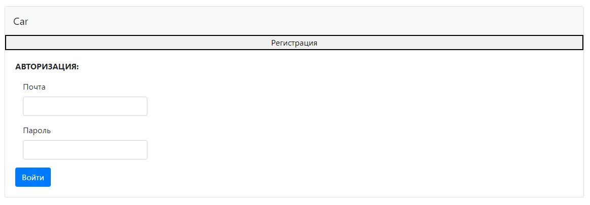

# Проект "Площадка для продажи авто"

* [Описание](#описание)
* [Функционал](#функционал)
* [Технологии](#технологии)
* [Архитектура](#архитектура)
* [Интерфейс](#интерфейс)
* [Автор](#автор)

## Описание:
Web прилложение - площадка по продаже автомобилей. 
Доступ к сайту имеют только зарегистрированные пользователи,
которые прошли процесс авторизации. У пользовател есть возможность добавить,
удалить объявлениеб сменить его статус, Реализован фильтр по поиску авто.
Вся информация хранится в базе данных

## Функционал
* Регистрация пользователя
* Авторизация через БД PostgreSQL
* Испольщование фильтров отбора
* Просмотр дополнительной информации
* Создание своего объявления
* Редактирование своего объявления
* Дополнительный функционал администратора

## Технологии
* Spring Boot
* Hibernate
* Java 16
* PostgreSql
* HTML, BOOTSTRAP
* Junit

## Архитектура
Проект реализован по шаблону MVC и разделён на слои:

1. Модели данных (Model)
1.1 [Advertisement](src/main/java/ru/job4j/car/model/Advertisement.java) - 
Модель для хранения объявлений

1.2 [User](src/main/java/ru/job4j/car/model/User.java) -
Модель для хранения пользователей

1.3 [Body](src/main/java/ru/job4j/car/model/Body.java)-
Модель для хранения корпусов автомобилей

1.4 [Engine](src/main/java/ru/job4j/car/model/Engine.java) -
Модель для хранения двигателей автомобилей

1.5 [Mark](src/main/java/ru/job4j/car/model/Mark.java) -
Модель для хранения марки автомобилей

1.6 [Engine](src/main/java/ru/job4j/car/model/Engine.java) -
Модель для хранения двигателей автомобилей

1.7 [Transmission](src/main/java/ru/job4j/car/model/Transmission.java) -
Модель для хранения двигателей автомобилей

1.8 [Photo](src/main/java/ru/job4j/car/model/Photo.java) -
Модель для хранения фотографий

2. Хранилища (persistence)

2.1 [DBStoreSession](src/main/java/ru/job4j/car/persistence/DBStoreSession.java) - 
Интерфейс для работы с сессией Hibernate (открытие/транзакция/закрытие)

2.2 [AdRepository](src/main/java/ru/job4j/car/persistence/AdRepository.java) -
CRUD класс по работе с объявлениями

2.3 [UserRepository](src/main/java/ru/job4j/car/persistence/UserRepository.java) -
CRUD класс по работе с пользователями

2.4 [BodyRepository](src/main/java/ru/job4j/car/persistence/BodyRepository.java) -
CRUD класс по работе с кузовами авто

2.5 [EngineRepository](src/main/java/ru/job4j/car/persistence/EngineRepository.java) -
CRUD класс по работе с двигателями авто

2.6 [MarkRepository](src/main/java/ru/job4j/car/persistence/MarkRepository.java) -
CRUD класс по работе с марками авто

2.7 [TransmissionRepository](src/main/java/ru/job4j/car/persistence/TransmissionRepository.java) -
CRUD класс по работе с трансмиссией авто

2.8 [PhotosRepository](src/main/java/ru/job4j/car/persistence/PhotosRepository.java) -
CRUD класс по работе с фотографиями авто

3. Контроллеры (control)
3.1 [AdController](src/main/java/ru/job4j/car/control/AdController.java) -
Контроллер по работе с объявления по продаже авто

3.2 [UserController](src/main/java/ru/job4j/car/control/UserController.java) -
Контроллер по работе с пользователями

3.3 [BodyController](src/main/java/ru/job4j/car/control/BodyController.java) -
Контроллер по работе с корпусом авто

3.4 [EngineController](src/main/java/ru/job4j/car/control/EngineController.java) -
Контроллер по работе с двигателем авто

3.5 [MarkController](src/main/java/ru/job4j/car/control/MarkController.java) -
Контроллер по работе с маркой авто

3.6 [TransmissionController](src/main/java/ru/job4j/car/control/TransmissionController.java) -
Контроллер по работе с трансмиссией авто

4. Фильтр

4.1 [AuthFilter](src/main/java/ru/job4j/car/filter/AuthFilter.java) -
Блокирует доступ неавторизованному пользователю ко всем страницами приложения,
кроме страниц авторизации и регистрации.

## Интерфейс

* Интерфейс приложения

При первом посещении искатель видит главную страницу со списком всех объялений.
при любой попытке взаимодействовать, будет отправлен на страницу авторизации / регистрации,
без авторизации все иные действия фильтруются и перенаправляются обратно.

* Регистрируемся

* Авторизируемся

* После успешной авторизации, пользователь попадает на главную страницу, где может:
    - пользоваться фильтрами отбора,
    - просматривать дополнительную информацию,
    - создавать свое объявление
    - 
при просмотре объявления, доступно только чтение
 

* Создаем объявление

при создании объявления: марка, кузов, коробка и двигатель выбираются из заранее созданных вариантов

* Редактируем

при посмотре своего объявления появляется возможность, отредактирова, удалить или поменять статус на продано
  

* Дополнительно:

Фильрация по маркам:

Есть дополнительный раздел, доступный только администратору, доступ ограничен.

С помощью этого раздела возможно заранее создавать некоторые элементы,
появляется доступ к редактированию всех объявлений

## Автор
Дмитрий

Java-разработчик

zweidmitr@gmail.com